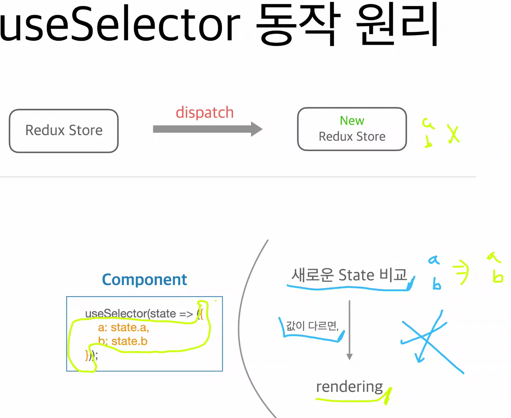
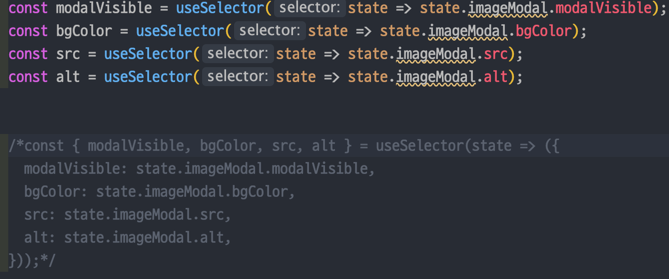

##1. Layout Shift 피하기
###1) Layout Shift 란?
1) 이미지가 먼저 로드된 것들이 밀려나는 현상
2) 확인 방법: devtools performance, light house
3) 발생 원인
   1) 사이즈가 정해져 있지 않은 이미지
   2) 사이즈가 정해져 있지 않은 광고
   3) 동적으로 삽입된 컨텐츠
   4) Web Font (FOIT, FOUT)
4) 해결 방법
   1) 사이즈를 정해주면 된다.
   2) 동적으로 로드해도 밀어내지 않도록 처리
   3) 웹 폰트 셋팅
5) 이미지를 비율로 확정하기.
   1) 이미지의 상위 요소를 비율 ratio 로 정하고, 이미지는 부모의 가로 100%, 세로 100%
   2) +css 지식 : 
   
      
##2. Image Lazy Load
1) react-lazyload
               

##3. useSelect 렌더링 문제 해결
- 원인 : 리덕스가 구독하는 스테이트 변경시 다른 값들이 함께 변경됨
         참조하고 있지 않는 스테이트들도 함께 변경되고 있음.

* **해결 방법**

**1. Object 를 새로 만들지 않도록 state 쪼개기**

**2. 새로운 Equality Function 사용**

**3. Redux reselect**
useSelector 내부에서 특정 값을 꺼내서 로직을 구성할 때,
로직을 사용하더라도, 리렌더링을 하지 않도록 처리해준다.

**4. memoization**
로직의 입력값과 출력값을 저장하고,
같은 입력값이 들어왔을 경우, 로직을 실행하지 않고 저장되어 있던 값을 출력함.

**사용해야 할 때**
입력값과 출력 값이 일정한 경우.
로직이 무거운 경우.

modal 을 열었을 때 백그라운드 컬러의 시간을 단축시켜야 함.
* 방법
  * 로직
  * 이전에 열었던 모달의 경우 memoization 을 적용.
* factory 패턴
* 

